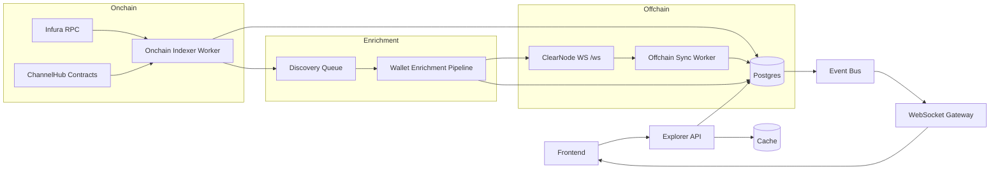
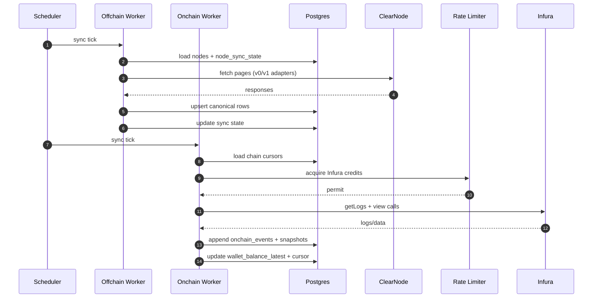
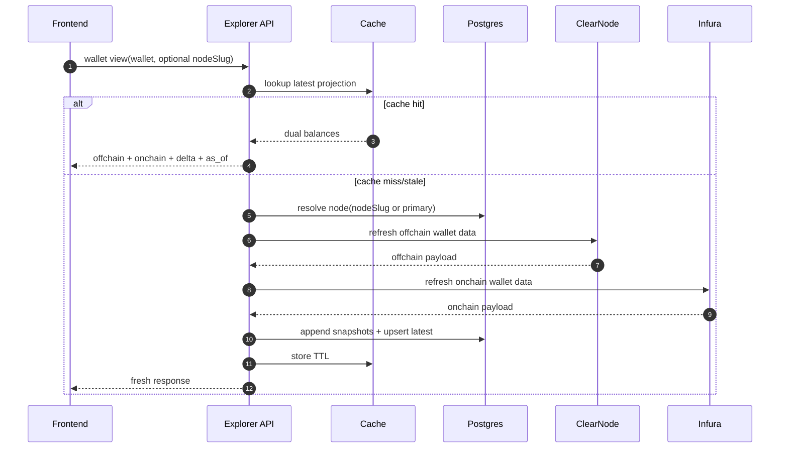

## 7. Diagrams

### Diagram 1 - System Topology

```mermaid
flowchart LR
  FE[Frontend] --> API[Explorer API]
  API --> CACHE[(Cache)]
  API --> DB[(Postgres)]

  subgraph Offchain
    CN[ClearNode WS /ws]
    W1[Offchain Sync Worker]
    CN --> W1
    W1 --> DB
  end

  subgraph Onchain
    INF[Infura RPC]
    HUB[ChannelHub Contracts]
    W2[Onchain Indexer Worker]
    INF --> W2
    HUB --> W2
    W2 --> DB
  end

  subgraph Enrichment
    Q[Discovery Queue]
    W3[Wallet Enrichment Pipeline]
    Q --> W3
    W3 --> CN
    W3 --> DB
  end

  W2 --> Q
  DB --> EVT[Event Bus]
  EVT --> WSG[WebSocket Gateway]
  WSG --> FE
```

### Diagram 2 - Dual Worker Orchestration

```mermaid
sequenceDiagram
  autonumber
  participant SCH as Scheduler
  participant W1 as Offchain Worker
  participant W2 as Onchain Worker
  participant DB as Postgres
  participant CN as ClearNode
  participant RL as Rate Limiter
  participant INF as Infura

  SCH->>W1: sync tick
  W1->>DB: load nodes + node_sync_state
  W1->>CN: fetch pages (v0/v1 adapters)
  CN-->>W1: responses
  W1->>DB: upsert canonical rows
  W1->>DB: update sync state

  SCH->>W2: sync tick
  W2->>DB: load chain cursors
  W2->>RL: acquire Infura credits
  RL-->>W2: permit
  W2->>INF: getLogs + view calls
  INF-->>W2: logs/data
  W2->>DB: append onchain_events + snapshots
  W2->>DB: update wallet_balance_latest + cursor
```

### Diagram 3 - DB ERD (Full)

```mermaid
erDiagram
  NODES ||--o{ NODE_SYNC_STATE : has
  NODES ||--o{ CHANNELS : sources
  NODES ||--o{ ASSETS : sources
  NODES ||--o{ NETWORKS : sources
  NODES ||--o{ APP_SESSIONS : sources
  NODES ||--o{ STATES : sources
  NODES ||--o{ APPS : sources
  NODES ||--o{ TRANSACTIONS : sources
  NODES ||--o{ OFFCHAIN_BALANCE_SNAPSHOTS : sources
  NODES ||--o{ ONCHAIN_BALANCE_SNAPSHOTS : sources
  NODES ||--o{ WALLET_BALANCE_LATEST : sources
  NODES ||--o{ ACTION_ALLOWANCE_SNAPSHOTS : sources
  NODES ||--o{ SESSION_KEY_STATES : sources

  ASSETS ||--o{ ASSET_TOKENS : has
  APP_SESSIONS ||--o{ APP_ALLOCATIONS : has
  CHANNELS ||--o{ STATES : evolves
  CHANNELS ||--o{ ONCHAIN_EVENTS : produces

  NODES {
    string id PK
    string slug UK
    string ws_url
    string protocol_family
    string protocol_version
    boolean is_primary
    boolean sync_enabled
    datetime updated_at
  }

  NODE_SYNC_STATE {
    string id PK
    string node_id FK
    string resource
    json cursor_json
    int retry_count
    datetime last_success_at
    text last_error
    datetime updated_at
  }

  CHANNELS {
    string id PK
    string node_id FK
    string channel_id
    string user_wallet
    string participant
    string channel_type
    string blockchain_id
    string token_address
    string amount
    string status
    string state_version
    json raw_payload
    datetime updated_at
  }

  STATES {
    string id PK
    string node_id FK
    string state_id
    string channel_id
    string user_wallet
    string asset
    string epoch
    string version
    string transition_type
    json raw_payload
    datetime updated_at
  }

  ASSETS {
    string id PK
    string node_id FK
    string asset_symbol
    string asset_name
    string decimals
    string suggested_blockchain_id
    json raw_payload
    datetime updated_at
  }

  ASSET_TOKENS {
    string id PK
    string node_id FK
    string asset_id FK
    string token_address
    string blockchain_id
    string decimals
    json raw_payload
    datetime updated_at
  }

  NETWORKS {
    string id PK
    string node_id FK
    string blockchain_id
    string name
    string contract_address
    string node_address
    string node_version
    json raw_payload
    datetime updated_at
  }

  APP_SESSIONS {
    string id PK
    string node_id FK
    string app_session_id
    string application_id
    string status
    string version
    string quorum
    string nonce
    json participants_json
    text session_data
    json raw_payload
    datetime updated_at
  }

  APP_ALLOCATIONS {
    string id PK
    string app_session_id FK
    string participant
    string asset
    string amount
    json raw_payload
    datetime updated_at
  }

  APPS {
    string id PK
    string node_id FK
    string app_id
    string owner_wallet
    string version
    json raw_payload
    datetime updated_at
  }

  TRANSACTIONS {
    string id PK
    string node_id FK
    string wallet
    string tx_id
    string blockchain_id
    string asset
    string tx_type
    string amount
    string source
    json raw_payload
    datetime created_at
  }

  ONCHAIN_EVENTS {
    string id PK
    string blockchain_id
    string contract_address
    string tx_hash
    int log_index
    int block_number
    string event_name
    string channel_id
    string user_wallet
    string node_address
    json raw_payload
    datetime block_timestamp
    datetime observed_at
  }

  OFFCHAIN_BALANCE_SNAPSHOTS {
    string id PK
    string node_id FK
    string wallet
    string asset
    string blockchain_id
    string offchain_balance
    string source_ref
    json raw_payload
    datetime captured_at
  }

  ONCHAIN_BALANCE_SNAPSHOTS {
    string id PK
    string node_id FK
    string wallet
    string asset
    string blockchain_id
    string onchain_balance
    string source_ref
    json raw_payload
    datetime captured_at
  }

  WALLET_BALANCE_LATEST {
    string id PK
    string node_id FK
    string wallet
    string asset
    string blockchain_id
    string offchain_balance
    string onchain_balance
    string balance_delta
    datetime offchain_as_of
    datetime onchain_as_of
    datetime updated_at
  }

  ACTION_ALLOWANCE_SNAPSHOTS {
    string id PK
    string node_id FK
    string wallet
    json allowances_json
    json raw_payload
    datetime captured_at
  }

  SESSION_KEY_STATES {
    string id PK
    string node_id FK
    string key_scope
    string user_address
    string session_key
    string expires_at
    json raw_payload
    datetime captured_at
  }
```

### Diagram 4 - Wallet Read Path

```mermaid
sequenceDiagram
  autonumber
  participant FE as Frontend
  participant API as Explorer API
  participant C as Cache
  participant DB as Postgres
  participant CN as ClearNode
  participant INF as Infura

  FE->>API: wallet view(wallet, optional nodeSlug)
  API->>C: lookup latest projection
  alt cache hit
    C-->>API: dual balances
    API-->>FE: offchain + onchain + delta + as_of
  else cache miss/stale
    API->>DB: resolve node(nodeSlug or primary)
    API->>CN: refresh offchain wallet data
    CN-->>API: offchain payload
    API->>INF: refresh onchain wallet data
    INF-->>API: onchain payload
    API->>DB: append snapshots + upsert latest
    API->>C: store TTL
    API-->>FE: fresh response
  end
```

